# Electoral Roll Extractor

> Extract, process, and structure voter information from electoral roll PDFs with high accuracy.

This tool automatically extracts voter information from scanned electoral roll PDFs and converts it into structured data formats (CSV/Excel) for easy analysis and use.

## System Workflow and Technology Stack

```mermaid
flowchart TD
    classDef mainNode fill:#f5b041,stroke:#333,stroke-width:2px,color:#333,font-weight:bold,rounded:10px
    classDef processNode fill:white,stroke:#333,stroke-width:1px,color:#333,font-weight:bold,rounded:8px
    classDef techNode fill:#f8f9fa,stroke:#ddd,stroke-width:1px,color:#555,font-weight:bold,font-style:italic,rounded:8px
    classDef subgraphStyle fill:transparent,stroke:#aaa,stroke-width:1px,color:#555,font-weight:bold,rounded:15px
    
    A([Electoral Roll raw PDF]) ==> B
    
    subgraph B["🔍 Image Processing"]
      direction LR
      B1["PDF to Images<br>Grayscale Conversion<br>Noise Reduction<br>Binary Thresholding"]
      B2["Technologies:<br>PDF2Image, Poppler<br>OpenCV, Pillow"]
      B1 -.- B2
    end
    
    B ==> C
    
    subgraph C["📦 Box Detection"]
      direction LR
      C1["Contour Detection<br>Region Extraction<br>Watermark Removal"]
      C2["Technologies:<br>OpenCV, NumPy"]
      C1 -.- C2
    end
    
    C ==> D
    
    subgraph D["📝 Text Extraction"]
      direction LR
      D1["Region Identification<br>OCR Processing<br>Text Collection"]
      D2["Technologies:<br>Tesseract"]
      D1 -.- D2
    end
    
    D ==> E
    
    subgraph E["🔄 Data Processing"]
      direction LR
      E1["Text Cleaning<br>Field Extraction<br>Data Structuring"]
      E2["Technologies:<br>Pandas, RegEx"]
      E1 -.- E2
    end
    
    E ==> F([Structured CSV Output])
    
    %% Apply custom styles
    class A,F mainNode
    class B1,C1,D1,E1 processNode
    class B2,C2,D2,E2 techNode
    class B,C,D,E subgraphStyle
    
    %% Color the main process boxes
    style B color:#1e8449,stroke:#1e8449
    style C color:#2874a6,stroke:#2874a6
    style D color:#7d3c98,stroke:#7d3c98
    style E color:#b9770e,stroke:#b9770e
```



## Key Features

- **Automated Data Extraction** - Extracts voter details from PDF electoral rolls
- **Image Enhancement** - Pre-processing for improved OCR accuracy  
- **Structured Output** - Organized data in CSV/Excel format
- **Easy Configuration** - Customizable for different electoral roll formats


## 📋 Requirements

- Python 3.7+
- Tesseract OCR
- Poppler utilities
- `opencv`

### Installation

- Clone the repository
  ```bash
  git clone https://github.com/neha-nambiar/electoral-roll-extractor.git
  cd electoral-roll-extractor
  ```

- Install dependencies
  ```python
  pip install -r requirements.txt
  ```
  
- Download and install Tesseract OCR and Poppler for your system

### Configuration

Update paths in `config.py` to match your environment:

```python
# Adjust these paths according to your system
TESSERACT_CMD = r'C:\Program Files\Tesseract-OCR\tesseract.exe'
POPPLER_PATH = r'path\to\poppler\bin'
```

### Usage

- Place the electoral roll PDF you want to process inside the `electoral-roll-extractor/data/input/` directory.
- Run the script:
  ```python
  python main.py
  ```
- The pipeline will process the input PDF and generate structured outputs (CSV/Excel) in the output directory `electoral-roll-extractor/data/output/`.

### Project Structure

```
electoral-roll-extractor/
├── config.py                  # Configuration settings
├── main.py                    # Main entry point
├── requirements.txt           # Dependencies
├── extractor/
│   ├── __init__.py
│   ├── image_processor.py     # Image processing functions
│   ├── text_extractor.py      # OCR and text extraction
│   ├── data_processor.py      # Data processing and formatting
└── data/                      # Data directory for input/output
    ├── input/                 # Input PDF files
    ├── output/                # Processed data output
    └── debug/                 # Debug images and logs
```
